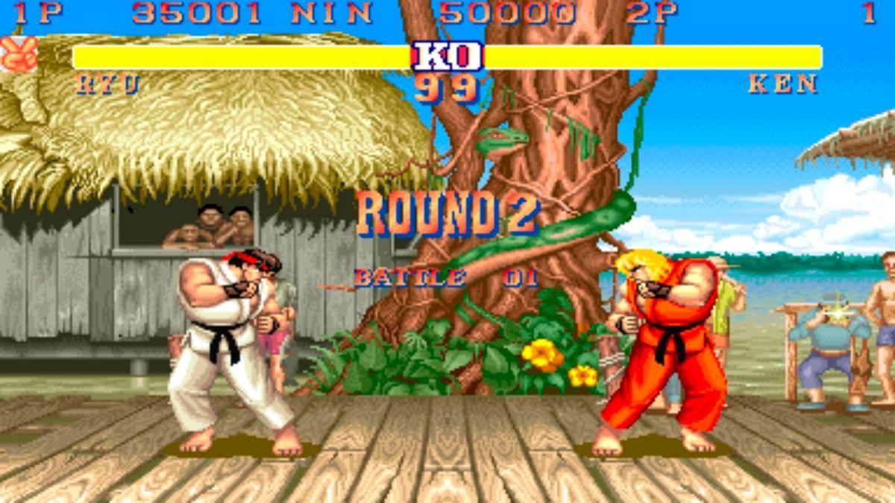
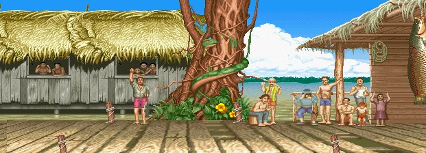

<h1>FIGHTING GAME</h1>



---

>**Juego:** https://mihai-cv.github.io/Canvas-Fighting-Game/

---

# Descripción del proyecto

El proyecto trata sobre un juego de lucha 1vs1 2d basado en los antiguos juegos de lucha de recreativas como el mitico Street Fighter 2, en el cual voy a intentar basarme para llevar a cabo este proyecto.

En principio el juego va a ser un 1vs1 con dos actores diferenciados, Ryu y Ken, cada uno con sus sprites, la base de sus movesets y un ataque especial por parte de cada uno. Constará de tres modos de juego, `1vs1`, `1vsIA` y `Training Mode`. En cuanto a las mecanicas lo uncio que habrá al inicio sera la vida de cada luchador, un timer para la pelea y un contador de puntos o hits. Dependiendo del avance en el proyecto se mirara de añadir una mecanica de mana para los ataques especiales.    

## Motivacion

Desde siempre me han encantado los fighting games y desde hace un tiempo he comenzado a adentrarme mas en el mundillo, aprendiendo muchisimo sobre como funcionan realmente y lo complejos que pueden llegar a ser. Lo que mas em ilusiona es ver si puedo plasmar alguno de estos concimientos que he adquirido sobre este genero en un juego creado por mi.
#

# Instalación y Ejecución

Deberemos ejecutar los siguientes comandos:

```console
git clone https://github.com/Mihai-CV/Canvas-Fighting-Game.git
cd FightingGame
yarn install
yarn run dev
```

# Moveset y controles

**W**: salto **S**: agacharse **A**: izquierda (defenderse) **D**: derecha    

 **J**: puñetazo debil **J**: puñetazo fuerte **N**: patada debil **M**: patada fuerte   
 
 ***COMBOS***     
 **Hadouken:** [**SD**] + **J**

 

 # Entornos y herramientas de desarrollo

 - El juego estará desarrollado en HTML Canvas Graphics
 - Trabajado en el entorno de Node.js
 - Lenguaje de programacion typescript
 - Se utiliza yarn como gestor de paquetes, de los cuales se destacan:
    - parcel
    - lodash
    - eslint

# Ideas y sprites a utilizar




---
